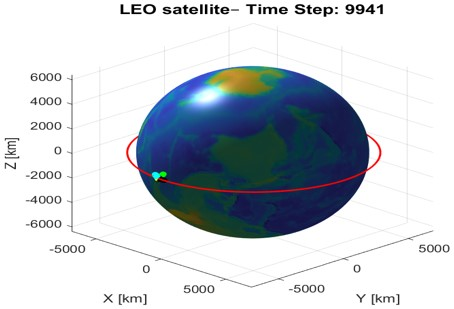
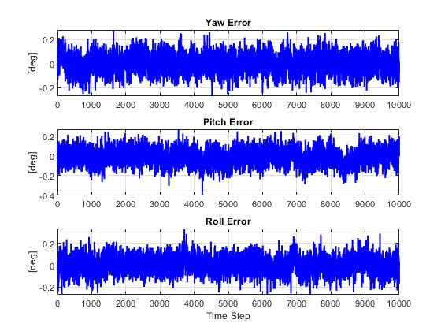
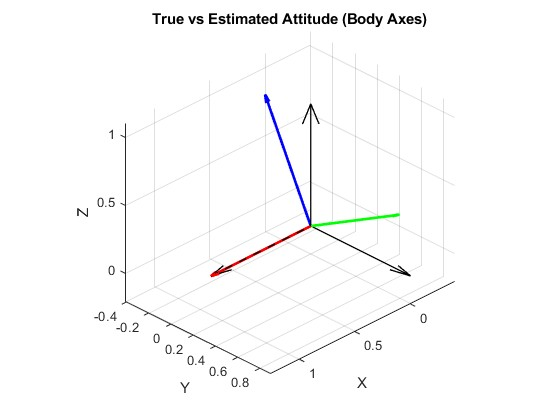

# 🚀 Quaternion-based Extended Kalman Filter (EKF) for Orbit & Attitude Estimation

This repository implements a **13-state Extended Kalman Filter (EKF)** for spacecraft attitude and orbit estimation using quaternions.

The system integrates:
- Orbital two-body gravitational dynamics
- Quaternion kinematics
- Gyroscope angular rate measurements
- Star-sensor quaternion measurements
- Position measurements with non-Gaussian impulse noise

---

## 📦 State Vector Definition

The EKF estimates the following **13-dimensional state**:

\[
x = [r, v, q, \omega]
\]

where:

| Symbol | Meaning | Dimension |
|------|------|------|
| **r** | Position (ECI frame) | 3 × 1 |
| **v** | Velocity (ECI frame) | 3 × 1 |
| **q** | Attitude quaternion | 4 × 1 |
| **ω** | Angular velocity (body frame) | 3 × 1 |

---

## 🛰️ Estimation Pipeline

✔ Orbital propagation via 2-body model  
✔ Runge-Kutta 4 integration (RK4)  
✔ Linearized EKF Jacobian  
✔ Gyroscope update  
✔ Position update with impulsive noise injection  
✔ Star-sensor quaternion update  
✔ Quaternion normalization every step  
✔ Euler angle RMSE evaluation  
✔ 3D orbit + attitude animation (AVI output)

---

## 🧠 Simulation Results

### 0️⃣ Orbit Visualization (True vs Estimated)

---

### 1️⃣ Euler Angle Error (Yaw / Pitch / Roll)

Attitude error is computed from quaternion difference:

\[
\theta = 2 \cos^{-1}(|q_{true}\cdot q_{est}|)
\]

---

### 2️⃣ Satellite Body-Frame Axes Orientation
Converted from quaternion → direction cosine matrix (DCM).

- **X-axis** → red  
- **Y-axis** → green  
- **Z-axis** → blue

---

### 3️⃣ 3D Orbit + Attitude Animation

📽 **Video Demo**  
👉 `orbit_attitude.avi`  
---

## 📂 Repository Structure

---

## 🧪 Requirements

- MATLAB **R2024a or newer**
- Aerospace Toolbox recommended

---

## 🔬 Research Context

This code is part of ongoing work on:
- Robust spacecraft attitude estimation
- GNSS/INS fusion
- Entropy-based nonlinear filtering

If you use this code, please reference:

> B. Ayalew — Orbit & Attitude Estimation using Nonlinear Kalman Filters (NTOU GNSS/GNC Research)

---

## 📜 License

MIT License.  
Free for research & academic use.
